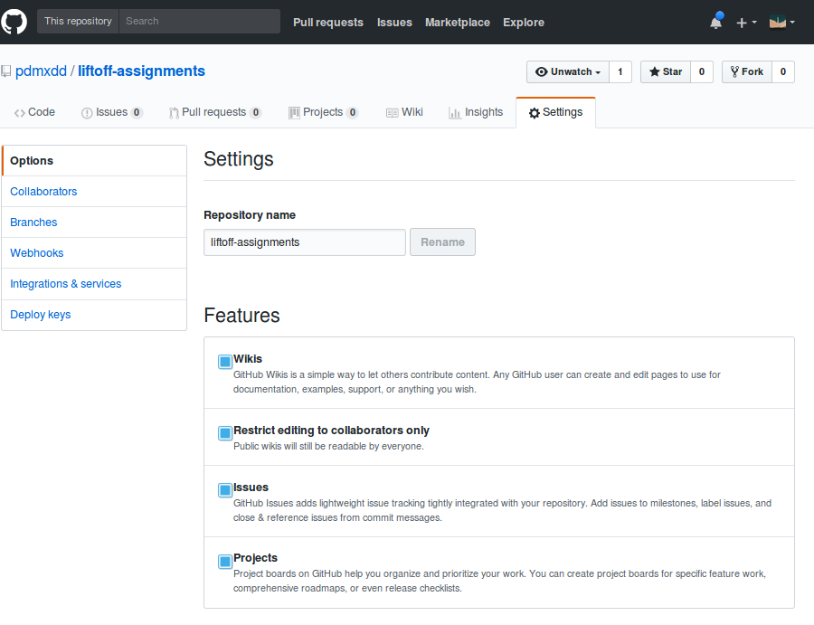

# Liftoff Assignments

This repository is the base repo for all assignments in LaunchCode's [Liftoff](https://education.launchcode.org/liftoff/) course.

## Getting Started

If you are enrolled in the Liftoff program, fork this repository and then clone it to your computer. Have a look through the directories. Each one corresponds to an assignment, and the README will provide additional details on the tasks to be carried out.

## Enable GitHub Issues

After forking the repository, you will need to *enable GitHub Issues* for your newly minted repository. GitHub Issues is a great tool for communication with other developers. GitHub Issues isn't automatically enabled for forked repositories. You will need to enable them so your mentor will be able to give you feedback through GitHub. To do this you will need to:

1. Go to your GitHub profile
2. Select your liftoff-assignments repository
3. Click on the Settings tab
4. Select the checkbox for Issues

## Submit Your Forked Repo URL to Canvas

Once you have forked your repo and enabled GitHub Issues, submit the URL of your new repo to Canvas to complete Assignment 1.
